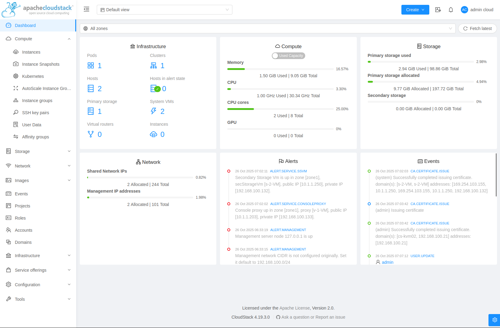

# Nested CloudStack with Ansible

After working with vSphere, KVM, XCP-NG, and OpenStack over the years, CloudStack was one platform I hadn't properly explored. Partly professional development, partly curiosity about cloud management platforms - I wanted to fill that gap.

The challenge was familiar: how do you test a distributed cloud platform without having multiple physical hosts lying around? The answer: nested virtualization.

## What This Does

I built an Ansible playbook that deploys a complete CloudStack environment on a single KVM host. It creates four nested VMs running on your physical machine:

- Management server (with MySQL)
- NFS storage server
- Two KVM compute hosts

The whole thing provisions itself using cloud-init, installs CloudStack 4.19, and gives you a working environment ready to configure via the CloudStack web UI.

## The Technical Bits

Getting this working was surprisingly straightforward - a few hours to get the automation right. My experience with other virtualization platforms meant I knew what to expect, but there were still a couple of sticking points.

**Cloud-init on Rocky Linux 9** turned out to be pickier than expected. Not dramatically difficult, just stricter about what it would accept. Eventually sorted it, but Ubuntu probably would have been easier. The project supports both Rocky 9 and Ubuntu 22.04, though I've tested Rocky more thoroughly. I'll likely revisit Ubuntu support to prove the playbook is truly OS-agnostic.

**Database schema deployment** caused a brief headache. Password issues meant the CloudStack schema wasn't deploying properly on first run. Typical database problems - once you spot them, they're obvious.

**Nested virtualization itself** was painless. As long as your CPU supports it (AMD-V or Intel VT-x with nested features enabled), it just works. The VMs boot with UEFI, enable nested virtualization via CPU passthrough, and can run their own guest VMs inside CloudStack.

## What I'm Actually Using It For

Right now I'm going through the full CloudStack workflow - configuring zones, pods, and clusters through the web interface. Creating OS images for guest instances and building out some demo environments.



The automation handles infrastructure deployment reliably. I've tested it extensively on KVM hosts and the Ansible run completes successfully. What it doesn't do is automate the CloudStack configuration wizard - that's still manual, though I might create a guide for it later.

## Hardware Requirements

You'll want at least 20GB of RAM to run this, but 32GB is more comfortable. Here's what the VMs actually consume:

- Management server: 4GB
- NFS server: 2GB
- Each compute host: 6GB

That's 18GB for the VMs alone, plus whatever your host OS needs. I'm running this on a Ryzen 7 9700X with 59GB RAM, so I've got plenty of headroom. Someone with 20GB could technically run it, but you'd be right at the limit with no room for anything else.

Storage-wise, you need around 200GB free in `/var/lib/libvirt/images`. The base cloud images aren't huge, but the VM disks add up quickly.

## Who This Is For

Pretty much anyone who needs to work with CloudStack:

- Students learning cloud platforms
- Sysadmins who need quick test environments
- People preparing for CloudStack deployments at work
- Anyone wanting to understand how CloudStack operates without building a full cluster

I built it for professional development, but it's equally useful for learning or testing features before deploying them in production.

## Future Plans

The current implementation is libvirt-specific, which works fine but limits portability. If I were starting over, I'd make it hypervisor-agnostic - supporting deployment on VMware ESXi, Proxmox, or whatever else people are running.

Same goes for the compute layer inside CloudStack. Right now it's KVM-focused, but supporting a range of hypervisors would make it more useful.

## Getting Started

If you want to try this yourself, the repository is at [nested-cloudstack-ansible](https://github.com/aloonj/nested-cloudstack-ansible).

You'll need Ubuntu 22.04+ or Debian 11+ with KVM installed, and an AMD or Intel CPU with nested virtualization enabled. Check the README for the full requirements.

Basic setup:

```bash
git clone https://github.com/aloonj/nested-cloudstack-ansible
cd nested-cloudstack-ansible
# Edit roles/libvirt-nested/tasks/main.yml and add your SSH public key (line 106)
ansible-playbook -i inventory/hosts.yml deploy-cloudstack.yml
```

The deployment takes 30-60 minutes. Once complete, you can access the CloudStack UI at http://192.168.100.10:8080/client with the default credentials (admin/password).

## Final Thoughts

CloudStack fills an interesting space in the cloud platform ecosystem. It's less complex than OpenStack but more feature-rich than just running bare KVM. Having a nested test environment makes it much easier to experiment with the platform without committing physical hardware.

The nested approach works well for testing and learning. You wouldn't run production workloads this way, but for understanding how CloudStack operates and testing configurations, it's more than adequate.

If you're looking to expand your virtualization platform knowledge, or need a disposable CloudStack environment for testing, this might be useful. The automation is stable enough that the Ansible run should complete successfully, and you'll have a working cloud platform to experiment with.
