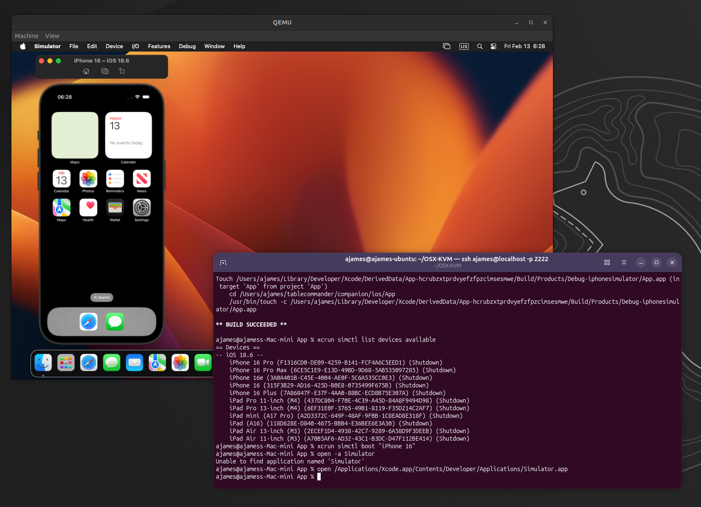
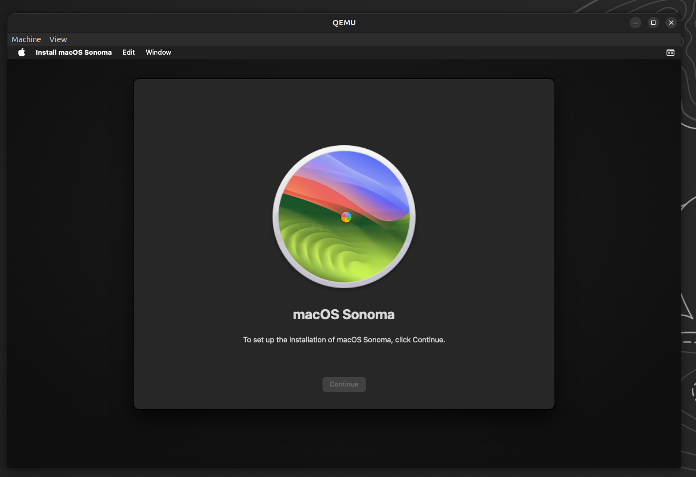
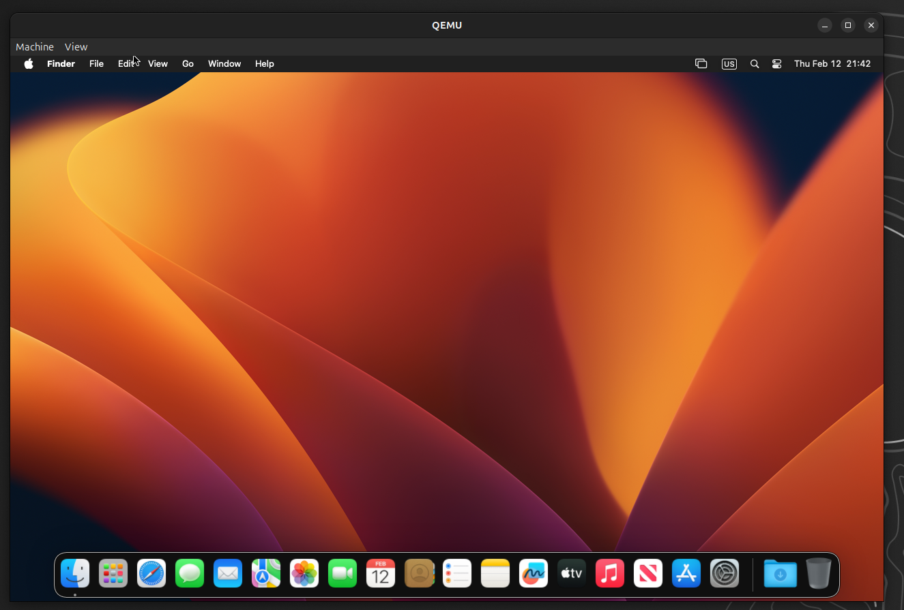
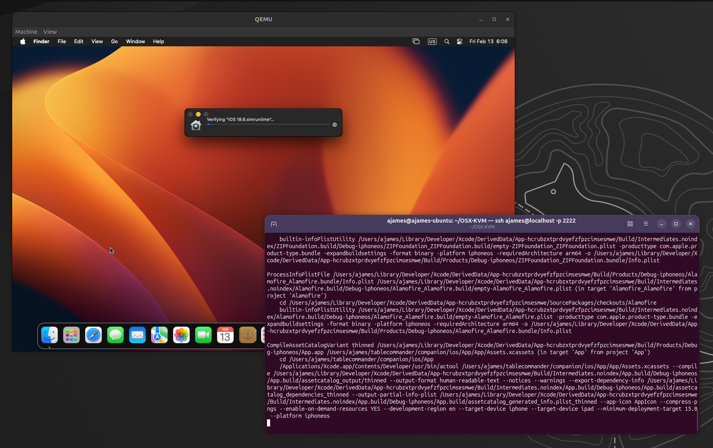

# Building iOS Apps on Linux with OSX-KVM

In my [previous post](web-app-to-play-store-with-capacitor.md) I mentioned iOS was next. The catch: Xcode requires macOS, and I don't own a Mac. Turns out a Linux box with KVM is enough to build a Node.js Capacitor app for iOS.



<!-- more -->

!!! warning "Disclaimer"
    Running macOS on non-Apple hardware is a grey area under Apple's EULA. Documented for educational purposes. Use at your own risk.

## The Setup

[OSX-KVM](https://github.com/kholia/OSX-KVM) handles the OpenCore bootloader, OVMF firmware, and QEMU configuration. You need an Intel or AMD CPU with virtualisation extensions, 16GB+ spare RAM, and ~80GB disk.



```bash
git clone https://github.com/kholia/OSX-KVM.git
cd OSX-KVM
./fetch-macOS-v2.py  # Pick Sonoma (14)
dmg2img BaseSystem.dmg BaseSystem.img
qemu-img create -f qcow2 mac_hdd_ng.img 128G
```

Tune `OpenCore-Boot.sh` — the defaults are too low for Xcode:

```bash
ALLOCATED_RAM="16384"
CPU_CORES="4"
CPU_THREADS="8"
```

Sonoma works with `Skylake-Client`. QEMU may warn about missing CPU features (PCID, RDSEED) — these are harmless.

### Apple ID

The default OpenCore ships with shared serial numbers. You'll hit "this Mac has been used to create too many Apple IDs". Either generate unique serials with [GenSMBIOS](https://github.com/corpnewt/GenSMBIOS), or just skip the Apple ID during setup — you don't need one on the Mac itself.



## SSH In, Skip the GUI

The QEMU GUI is laggy. Enable SSH in the VM and work remotely:

```bash
sudo systemsetup -setremotelogin on
```

The boot script already forwards port 2222, so from Linux:

```bash
ssh user@localhost -p 2222
```

Everything from here happens over SSH.

## Xcode and Node

Download Xcode from [developer.apple.com/download](https://developer.apple.com/download/all/) in your Linux browser, SCP it over:

```bash
scp -P 2222 ~/Downloads/Xcode_16.4.xip user@localhost:~/
```

On the VM:

```bash
xip -x ~/Xcode_16.4.xip
sudo mv Xcode.app /Applications/
sudo xcode-select -s /Applications/Xcode.app
xcodebuild -license accept
sudo xcodebuild -runFirstLaunch

# Node.js for Capacitor
curl -o node.pkg "https://nodejs.org/dist/v22.14.0/node-v22.14.0.pkg"
sudo installer -pkg node.pkg -target /
```

## Building

Clone, install, build, done:

```bash
git clone git@github.com:your/repo.git
cd repo/companion
npm install && npm run build
npx cap sync ios
cd ios/App
xcodebuild -project App.xcodeproj -scheme App \
  -destination "generic/platform=iOS" \
  -configuration Debug CODE_SIGNING_ALLOWED=NO
```

`CODE_SIGNING_ALLOWED=NO` skips certificates — fine for verifying the build compiles.



## Running in the Simulator

The iOS Simulator works inside the VM too. Build for the simulator SDK, then launch it:

```bash
xcodebuild -project App.xcodeproj -scheme App \
  -sdk iphonesimulator -configuration Debug

xcrun simctl list devices available
xcrun simctl boot "iPhone 16"
open /Applications/Xcode.app/Contents/Developer/Applications/Simulator.app

xcrun simctl install "iPhone 16" \
  ~/Library/Developer/Xcode/DerivedData/App-*/Build/Products/Debug-iphonesimulator/App.app
xcrun simctl launch "iPhone 16" com.tablecommander.companion
```

You'll need the QEMU GUI window for this one — the simulator is graphical. It runs surprisingly well.


## Day-to-Day Workflow

1. Write code on Linux
2. Push to git
3. SSH into the VM: `git pull && npm run build && npx cap sync ios`
4. `xcodebuild`

The Mac VM is just a build machine.

## For App Store

You don't need an Apple ID on the Mac or the Xcode GUI. You do need an **Apple Developer Account** ($99/year), signing certificates (generated in the web portal), and `xcrun altool` to upload. All account management happens in your browser on Linux.

For Capacitor/React Native/Flutter apps where the Mac is just a build tool, a KVM VM does the job.

```
** BUILD SUCCEEDED **
```
